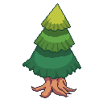
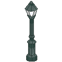
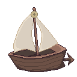

# Day by Day

**A cozy pixel-art island game about coming back.**

Most habit apps punish you for failing: miss a day and your streak resets to zero, which is exactly when people quit.
Day by Day is built for the day *after* you fail. You plan small goals in the real world, a kitten on your own little
island reflects how you're doing, and coming back after time away is the most rewarding thing you can do.

<p>
  
  
  
  
  
  
  
</p>


## How a day works

1. **Check in.** "How are you feeling today?" Good, Okay, Bad or Terrible. There is no wrong answer.
2. **Plan gently.** Add a few tasks. The harder your day, the fewer prompts you see. A terrible day is simply a rest day,
   with no planning at all.
3. **Do one small thing.** Check tasks off to fill your progress ring and earn coins. A third of your day earns a star,
   and finishing everything earns another star plus a handful of bonus coins.
4. **The evening is a second chance.** If the day got away from you, the list shrinks to just what matters most, and
   finishing that still counts in full.

Your kitten isn't you, and you don't control it. It lives on your island, wanders, runs over to see new props, and its
mood follows how you said you're feeling.

## Built for coming back

- **Stars are never taken away.** There is no streak to lose. Shop items unlock by the stars you've *ever* earned, so
  nothing gets locked again.
- **Comebacks count up, never down.** Every return after time away is celebrated ("Comeback number 3, be proud of
  yourself"), and after a longer break you can win back the stars from the days you missed.
- **Letters to future you.** On a good day, write a few kind words. On a hard day, your cat hands one back. New players
  start with a "fresh start" letter. Letters never leave your device.
- **Gentle words only.** No guilt, no pressure, no emojis. Rest is only suggested when you say you're feeling terrible.

## Friends who lift you up

- **Encourage a friend** with a message, and optionally coins or stars that they only receive once they reach a goal you
  set (a third of their day by default), so the gift rewards action.
- **Lanterns:** encouragement you receive glows as a lantern on your island until you tap it to read it.
- **Visits:** sail your cat to a friend's island by boat. Visitors drop a few coins for whoever they're visiting.
- Friends get a gentle note when you're having a hard day or falling behind, so they know to check in (without being
  told why).

## Gentle helpers (Google Gemini)

With a Gemini API key on the server, new tasks get a second look:

- **Smaller steps** for tasks you rate hard, or that sound hard (like "run for an hour"). The steps always add up to
  the *whole* task, their size follows your mood, and you tick which ones to keep. Short tasks like "study for 5
  minutes" are left alone.
- **Kinder names** for tasks worded harshly ("stop being lazy and study").

The key stays on the server and never reaches the browser. The helpers are on by default and can be turned off in the
profile, and the game works fully without them.

## The island

Hand-drawn pixel art, rendered pixel-perfect at any zoom, with a smooth camera. There's a day and night cycle, and
street lights that glow after dark. Buy fences, trees, street lights and houses in the shop with the coins you earn,
place them anywhere on the grass, and press and hold a prop to put it back in your inventory. It works on phones too,
with drag, pinch-to-zoom and a swipeable bottom menu.

## Getting started

You need [Node.js](https://nodejs.org).

```bash
npm install
npm run dev
```

Then open <http://localhost:8080>. The dev server also runs the online prototype (accounts, friends, encouragement and
visits), which saves to `server/data/online-db.json`.

**Optional: Gemini.** Create a file named `.env.local` in the project folder (git ignores it) with:

```
GEMINI_API_KEY=your-key-here
```

Restart `npm run dev` after adding it. Everything else works without it.

## Playing it online

The game can be hosted so anyone can play from a link, on any computer or phone, with nothing to install.
`npm run build` then `npm start` runs the finished game with its online features and Gemini helpers
(`server/ProductionServer.mjs`), and `render.yaml` sets this up on [Render](https://render.com) for free:

1. In Render, choose **New > Blueprint** and pick this repository.
2. Paste a Gemini key when it asks for `GEMINI_API_KEY`. It stays in Render's settings, never in the repository.
3. Once it's deployed, share the link Render gives you.

Free hosting sleeps when nobody's playing (the first visit after that takes about a minute to wake it), and online
accounts and friends reset whenever it restarts.

| Command | What it does |
| --- | --- |
| `npm run dev` | Development server with hot reloading, at `http://localhost:8080` |
| `npm run dev-phone` | The same, reachable from a phone on the same Wi-Fi |
| `npm run build` | Production build in `dist` |
| `npm start` | Run the production build with its online features, for hosting |
| `npm run dev-nolog` / `npm run build-nolog` | The same, without the Phaser template's anonymous usage ping (see `log.js`) |

## Demo controls

For showing everything on one screen, the development build has keyboard shortcuts. Press `1` to show the debug menu,
which lists all of them. **Sam** is a ready-made demo friend (password `demo`), and signing up as `daniel` always
starts a brand new account.

| Key | Action | | Key | Action |
| --- | --- | --- | --- | --- |
| `H` | Skip to tomorrow morning | | `N` | Sam leaves a lantern |
| `J` | Go to night | | `M` | Sam encourages you |
| `K` | Be away for 3 days | | `V` | Sam visits your island |
| `Y` | Get 50 coins | | `T` | Sam has a tough day |
| `U` | Earn 5 stars | | `1` | Show or hide the debug menu |

[ONLINE_PLAYTEST.md](ONLINE_PLAYTEST.md) covers playing with two windows, on a phone, and resetting the demo.

## Project structure

| Folder | What's inside |
| --- | --- |
| `src/game/scenes` | The island scene, and the overlay that draws lamp light at night |
| `src/game/state` | Days, check-ins, tasks, stars, comebacks, letters, lanterns and saving |
| `src/game/systems` | Camera, pixel snapping, day and night lighting, prop placement, boats and visitors |
| `src/game/data` | Tunable settings: the shop, the day's rules, and every gentle message the game says |
| `src/ui` | The HTML interface: to-do list, progress ring, shop, profile, check-in cards and notices |
| `src/online` | Talking to the online prototype and the Gemini helpers |
| `src/audio` | Sound effects |
| `server` | The online prototype and the Gemini proxy, both running inside the Vite dev server |
| `public/assets` | Pixel art, sounds and the pixel font |

## Privacy

Progress is saved in your browser per account; playing as a guest keeps nothing. With the gentle helpers on, only task
names, how hard they feel and how you're feeling today are sent to Google. Letters to future you are never sent
anywhere.

## Credits

Made at ShellHacks with [Phaser 4](https://phaser.io), TypeScript and Vite. The pixel art is hand-drawn for this game.
Started from the [Phaser Vite TypeScript template](https://github.com/phaserjs/template-vite-ts), MIT
licensed (see [LICENSE](LICENSE)).
